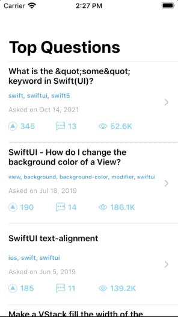
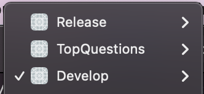

# TopQuestionsApp

### Author: Ricardo Montesinos Fernandez

## How to use:

The project can be executed by selecting the corresponding Scheme:

The project have three schemes, the default one *TopQuestions*, Develop and Release.

In order to make a HTTP REST request to the TopQuestions server use the Release scheme.

For developing purposes, execute the app using the Develop scheme, with this setup the request is made locally by using the mocked json files.
